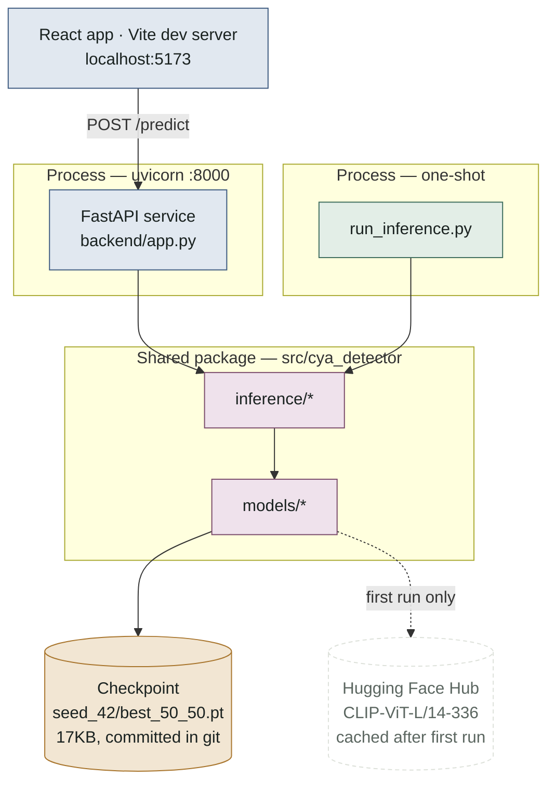

# Robust AI-Generated Image Detection

This branch is the judge-facing submission package: the inference CLI, a
thin FastAPI backend, and the React UI that calls it. The full development
history (data pipeline, training, rejected candidates, robustness
experiments across Tasks 1–10) lives on `main`; this branch keeps only what's
needed to install and run the final result.

## Project overview

This project classifies images as either **fully authentic** or **fully
AI-generated**, weighted 50% clean accuracy and 50% robustness to common
image transforms (JPEG re-compression, blur, resize).

The retained model is **controlled RINE**: a frozen-CLIP intermediate-layer
representation (CLIP-ViT-L/14-336, layers 6/12/18/24) with a lightweight
trained linear head, retrained under a balanced clean-or-one-transform
sampler. It reached 100.00% clean accuracy, 99.62% mean robustness accuracy,
and a 99.81% locked 50/50 score across seeds 42/43/44. Frequency, color/Lab,
PRNU, and a texture-aware local-patch path were all built and evaluated as
candidate additions and were all **rejected** after failing the locked-score
or robustness gate (see the
[`main`-branch experimental history](https://github.com/maxi-cmyk/cya-techjam26/blob/main/docs/planning/nextSteps.md)
for the full record).

**Sealed `final_test` result (run exactly once, 2026-08-31, 141 held-out
samples): 99.29% overall accuracy** — 100.00% AI-generated accuracy (69/69,
0.00% false negative rate), 98.61% authentic accuracy (71/72, **1.39% false
positive rate**), controlled RINE seed 42, T=1 (uncalibrated, see
[Limitations](#limitations-and-what-wed-improve-with-more-time)).

**Submission entry point:** [`run_inference.py`](run_inference.py) at the
repository root — takes a directory of images, writes `predictions.json` and
`report.json`, and uses the real controlled-RINE seed-42 checkpoint by
default. The checkpoint is committed directly in this repository
(`artifacts/robustness/train-controlled-rine/seed_42/best_50_50.pt`, 17KB;
the frozen CLIP backbone downloads automatically from Hugging Face on first
use). **No Colab, Drive access, or manual staging needed** — `git clone` +
`pip install` + run is the complete judge-facing path.

See [How the inference pipeline works](docs/inference-pipeline.md)
for the complete path from directory discovery through C2PA verification,
controlled-RINE scoring, confidence validation, and atomic JSON publication.

The `backend/` FastAPI service and `frontend/` React app wrap the same CLI
logic behind a drag-and-drop UI, for a visual demo of the same model.

## Architecture

Two processes, one shared Python package, one external download. Nothing
else needs a network: the judge-facing path is `git clone` + `pip install` +
run.



- **`python run_inference.py`** — runs once and exits. Loads the CLIP
  backbone + checkpoint into its own process memory, scores a directory,
  writes `predictions.json` / `report.json`, returns an exit code. Nothing to
  start, nothing left running.
- **`uvicorn backend.app:app` (`:8000`)** — loads the same checkpoint once at
  first request (`get_predictor()` caches it module-level) and keeps it
  resident for every subsequent `/predict` call. CORS is wide open — a local
  demo server, not hardened for public exposure.
- **Vite dev server (`:5173`)** — static React app; ships zero model logic.
  Its only coupling to the rest of the system is the hardcoded
  `localhost:8000` fetch target.
- **Checkpoint** — `artifacts/.../seed_42/best_50_50.pt`, 17KB, checked into
  git directly. No Drive access, no Colab, no manual staging required to
  reproduce a judge's run.
- **CLIP weights** — `openai/clip-vit-large-patch14-336` pulled from Hugging
  Face on first use, then cached by `transformers`' local cache — every run
  after the first is fully offline.
- **`c2pa-python`** — imported lazily inside `c2pa.py`; a missing install
  just makes the Stage-0 claim check return `False` and fall through to the
  model — it can't take the pipeline down.

## Setup and installation instructions

Requires Python >= 3.10.

```bash
git clone https://github.com/maxi-cmyk/cya-techjam26.git
cd cya-techjam26
python -m pip install -r requirements.txt
python -m pip install -e . --no-deps
```

To run the test suite, install the development dependencies as well (no GPU
or dataset required):

```bash
python -m pip install -r requirements-dev.txt
python -m pytest tests/
```

### Backend + frontend for UI demo for visualisation

```bash
# Terminal 1 — backend API (from the repo root)
PYTHONPATH=src python -m uvicorn backend.app:app --port 8000

# Terminal 2 — frontend dev server
cd frontend
npm install
npm run dev
```

Open the printed frontend URL (default `http://localhost:5173`), drag in an
image, and it's scored by the same controlled-RINE model as the CLI via
`POST http://localhost:8000/predict`.

## Steps to reproduce results using CLI

### Running the submission script 

```bash
python run_inference.py <path-to-image-directory> --output-dir <output-directory>
```

**Judge quick start:** after completing the installation steps above, place an
image directory in the repository root (for example, `judge_images/`) and run:

```bash
# Run from the repository root
python run_inference.py judge_images --output-dir judge_output
```

The results will be written to `judge_output/predictions.json` and
`judge_output/report.json`. The input directory may also be located elsewhere;
pass its absolute or relative path in place of `judge_images`. Internet access
is required on the first model-backed run so Hugging Face can download the
frozen CLIP backbone. Later runs reuse the downloaded model cache.

Recursively discovers `.jpg`/`.jpeg`/`.png`/`.webp`/`.tif`/`.tiff` files
under `<path-to-image-directory>` (case-insensitive, symlinks never
followed), runs each through a C2PA verified-AI-generation-claim check
followed by the predictor, and writes:

- `<output-directory>/predictions.json` — `[{"image_path": "...", "pred": 0.0-1.0}, ...]`
- `<output-directory>/report.json` — `{"schema_version", "summary": {"discovered", "predicted", "invalid"}, "errors": [...]}`

Exit codes: `0` full success, `1` fatal (nothing published — e.g. an empty
input directory), `2` bad arguments, `3` partial success (some images were
invalid; `predictions.json` still contains every image that scored
successfully, and `report.json` explains why the rest didn't).

A minimal check that it works:

```bash
mkdir -p /tmp/demo_images /tmp/demo_output
python -c "from PIL import Image; Image.new('RGB', (64, 64)).save('/tmp/demo_images/sample.png')"
python run_inference.py /tmp/demo_images --output-dir /tmp/demo_output
cat /tmp/demo_output/predictions.json
```

### Reproducing the training/evaluation results

The full data pipeline, training code, evaluation harness, and experiment
notebooks live on the public `main` branch. From this checkout, switch to it
and install the complete development environment:

```bash
git checkout main
python -m pip install -r requirements.txt
python -m pip install -r requirements-dev.txt
python -m pip install -e . --no-deps
make test
```

Reproduce the retained controlled-RINE clean/robustness result in Google
Colab by running these notebooks in order:

1. `notebooks/00_colab_setup.ipynb` — install dependencies and mount the
   configured dataset/artifact roots.
2. `notebooks/01_task2_data_contract.ipynb` — build the matched-clean
   fixed-Q96 manifest and deterministic splits.
3. `notebooks/02_stage_a_clip.ipynb` — run the frozen-CLIP Stage A baseline.
4. `notebooks/03_rine_stage_b.ipynb` — run the initial RINE ablation.
5. `notebooks/07_robustness_rerun.ipynb` — materialize the 14 independent
   transform cells and train/evaluate controlled RINE with seeds 42, 43,
   and 44.

The expected aggregate result is 100.00% mean clean accuracy, 99.62% mean
robustness accuracy, and a 99.81% mean locked score, where
`locked_score = 0.5 * clean_accuracy + 0.5 * mean_transform_accuracy`.
The source image dataset and shared Colab artifact store are not committed
to Git because of their size and licensing; reproducing the numeric training
result requires access to those inputs. The notebooks validate their
manifests before training and write the checkpoints, per-cell predictions,
metrics, and retention decisions under `artifacts/robustness/`.

For the rejected texture candidate, then run
`notebooks/09_texture_stage_d.ipynb` followed by
`notebooks/10_texture_robustness_stage1.ipynb`. The expected decision is
`reject_texture_robustness_stage1`.

The complete recorded evidence and model-selection decisions are in the
[`main`-branch roadmap](https://github.com/maxi-cmyk/cya-techjam26/blob/main/docs/planning/nextSteps.md).
The sealed 99.29% `final_test` result is intentionally not rerunnable:
`notebooks/11_final_test.ipynb` performed the one authorized read, and
`scripts/run_final_test.py` refuses to overwrite or resume an existing final
evaluation. Do not delete its prior output to force another run.

## Limitations and what we'd improve with more time

- **Reported probabilities are uncalibrated (T=1) by deliberate decision, not
  oversight.** Fitting one temperature on seed 42's clean `selection_val`
  logits produced a degenerate result — that set has zero classification
  errors, so NLL minimization had nothing to penalize and just drove the
  temperature to the search bound. We chose to ship raw sigmoid outputs
  rather than a fit we couldn't validate.
- **C2PA verified-claim detection is implemented against the spec but not
  validated against a real signed sample** — it should be checked against
  one before being relied on for the fast-path early exit.
- **No latency/memory numbers exist yet on target hardware.** The predictor
  has been verified to run correctly end-to-end on local CPU, but hasn't
  been profiled on the target Colab GPU.
- **Given more time**, priority order:
  (1) fit a non-degenerate calibration on data that actually contains errors
  (2) validate the C2PA schema against a real signed sample
  (3) run resource profiling on target hardware
  (4) revisit the rejected texture-aware path with a more robust fusion strategy under aggressive downsampling/blur, since it matched controlled RINE on clean accuracy but failed only on robustness.

## Team member contributions

Max (maxi-cmyk) — Built the repository infrastructure, reproducible configuration, Colab workflows, and image-data pipeline; implemented the CLIP/RINE detector baselines, evaluation and robustness tooling, physical-feature experiments, inference backend and CLI, calibration, resource profiling, final-test workflow, and submission integration.

Rae (raetan2023) — Built the deterministic image-transformation and augmentation framework for JPEG, blur, resize, noise, color, and crop robustness; designed and implemented the texture-aware local-detail detector; and strengthened testing, cross-platform behavior, architecture, planning, and submission documentation.

Shan He (cshsean) — Implemented the initial deterministic frequency, color, optics, PRNU, and texture feature extractors with tests; authored SAFE augmentation and training-data guidance; and built the React/Vite image-prediction and evaluation-dashboard frontend.
