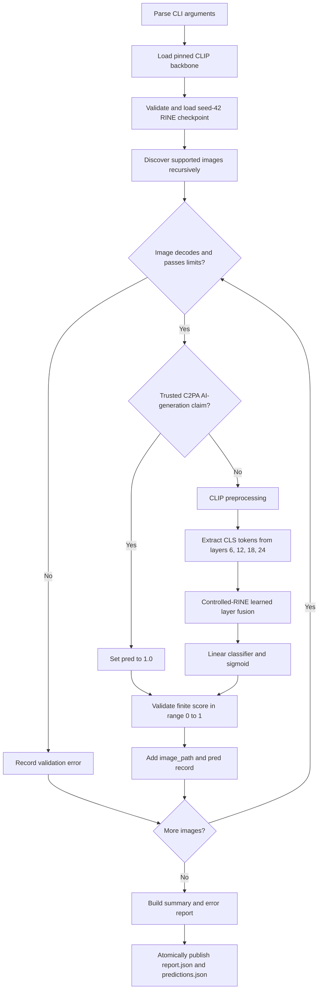

# How the inference pipeline works

The submission command accepts a directory of images and writes one
AI-generation confidence score for every image that can be validated and
scored successfully.

```bash
python run_inference.py <image-directory> --output-dir <output-directory>
```

The public output is `<output-directory>/predictions.json`:

```json
[
  {
    "image_path": "nested/example.png",
    "pred": 0.08335919678211212
  }
]
```

`image_path` is relative to the supplied input directory. `pred` is a finite
number from `0.0` to `1.0`:

- `0.0` means strongest confidence that the image is fully authentic.
- `1.0` means strongest confidence that the image is fully AI-generated.
- Values near `0.5` are less certain.

The script publishes the continuous confidence required by the challenge; it
does not add a label to the public JSON. If a binary decision is needed, the
model's fixed decision threshold is `0.5`. The probability is the model's raw
sigmoid output with temperature `T=1`; it is not post-hoc calibrated.

## Pipeline at a glance



## Step-by-step execution

### 1. Parse the command

The repository-root [`run_inference.py`](../run_inference.py) exposes the
submission entry point and delegates to
[`src/cya_detector/inference/cli.py`](../src/cya_detector/inference/cli.py).
The CLI accepts:

- `image_dir`: the directory to scan.
- `--output-dir`: where the two JSON files will be written.
- `--checkpoint`: an optional path to a compatible checkpoint.
- `--device cpu|cuda`: `cpu` by default.
- `--no-checkpoint`: an explicit test-only mode that returns constant `0.5`
  values; it is not part of the submission inference path.

The default checkpoint is committed at
`artifacts/robustness/train-controlled-rine/seed_42/best_50_50.pt`. A missing
checkpoint is fatal, so the submission cannot silently publish placeholder
scores.

### 2. Load the pinned model

The predictor loads the frozen vision tower from
`openai/clip-vit-large-patch14-336`, pinned to immutable Hugging Face revision
`ce19dc912ca5cd21c8a653c79e251e808ccabcd1`. The backbone downloads on the
first model-backed run and is reused from the Hugging Face cache afterward.

The loader places CLIP in evaluation mode, disables gradients for every
backbone parameter, and moves it to the selected device. The model is loaded
once per command, not once per image.

### 3. Validate the trained head

[`src/cya_detector/inference/rine_predictor.py`](../src/cya_detector/inference/rine_predictor.py)
rejects a checkpoint unless its metadata matches the frozen inference
contract:

```text
stage: controlled_rine_robustness
seed: 42
matching_policy: fixed_q96
layers: 6, 12, 18, 24
```

It then loads the learned layer-importance parameters and binary classifier,
switches the RINE head to evaluation mode, disables its gradients, and moves
it to the selected device.

### 4. Discover inputs deterministically

[`src/cya_detector/inference/inputs.py`](../src/cya_detector/inference/inputs.py)
recursively discovers `.jpg`, `.jpeg`, `.png`, `.webp`, `.tif`, and `.tiff`
files, case-insensitively. It never follows file or directory symlinks.

Paths are normalized to Unicode NFC, converted to relative POSIX paths, and
sorted by their UTF-8 bytes. This makes the output order repeatable across
runs. An absent directory, empty discovery, or normalized path collision is
fatal and produces no new output.

### 5. Decode, validate, and normalize each image

Each file is decoded with Pillow and checked before inference. The validator
rejects unreadable or unsupported files, corrupt image data, invalid
dimensions, and images exceeding 64 million pixels. A valid image is
converted to an owned RGB image, so supported grayscale, alpha, palette, and
other modes reach the predictor consistently.

A known per-image validation failure is recorded in `report.json`, and the
run continues with the next image. An unexpected loading failure remains
fatal instead of being silently reclassified.

### 6. Check trusted C2PA provenance

[`src/cya_detector/inference/c2pa.py`](../src/cya_detector/inference/c2pa.py)
checks the original file for a trusted active C2PA manifest containing a
`c2pa.created` action whose `digitalSourceType` includes
`trainedAlgorithmicMedia`.

When that exact verified claim is present, the pipeline assigns `pred = 1.0`
without invoking CLIP. Missing provenance, an invalid or untrusted signature,
an authenticity-only claim, an unavailable C2PA parser, or malformed metadata
all fall through to the neural predictor. Remote-manifest and OCSP fetching
are disabled. As noted in the main README's limitations, this path is
implemented against the C2PA API but has not yet been checked against a real
signed sample.

### 7. Preprocess with the pinned CLIP processor

For images without the verified C2PA shortcut, the pinned CLIP processor
performs the resize, crop, tensor conversion, and normalization expected by
CLIP-ViT-L/14-336. The resulting tensor is moved to the selected device.

### 8. Extract four intermediate representations

The frozen CLIP vision model runs with hidden-state output enabled. The
predictor selects the CLS representation from layers 6, 12, 18, and 24 and
stacks them into a tensor with conceptual shape:

```text
[batch, 4 layers, 1024 hidden features]
```

### 9. Apply controlled-RINE fusion

[`src/cya_detector/models/rine.py`](../src/cya_detector/models/rine.py)
layer-normalizes each representation. A softmax over four learned importance
parameters produces the layer weights. Their weighted sum becomes one fused
1024-dimensional representation, which passes through the trained linear
binary classifier.

```text
CLIP layer 6 CLS  ─┐
CLIP layer 12 CLS ─┤
CLIP layer 18 CLS ─┼─ learned weighted sum ─ linear classifier ─ sigmoid
CLIP layer 24 CLS ─┘
```

The classifier produces one logit. Applying sigmoid converts it to the public
`pred` confidence.

### 10. Validate and retain the prediction

[`src/cya_detector/inference/runner.py`](../src/cya_detector/inference/runner.py)
requires the result to be numeric, finite, and within `[0.0, 1.0]`. A Boolean,
NaN, infinity, out-of-range result, or predictor exception is fatal. The
decoded Pillow image is closed whether prediction succeeds or fails.

Each successful image becomes exactly:

```json
{"image_path": "relative/path.png", "pred": 0.0}
```

No absolute filesystem paths are included in the public output.

### 11. Build the report

The companion `report.json` records the number of files discovered, scored,
and rejected as invalid, plus stable per-image error codes:

```json
{
  "schema_version": 1,
  "summary": {
    "discovered": 2,
    "predicted": 1,
    "invalid": 1
  },
  "errors": [
    {
      "image_path": "broken.png",
      "code": "unsupported_image",
      "message": "Unsupported or unrecognized image format."
    }
  ]
}
```

The stable error codes are `file_unreadable`, `decode_failed`,
`unsupported_image`, `invalid_dimensions`, and `decompression_bomb`.

### 12. Publish atomically

[`src/cya_detector/inference/output.py`](../src/cya_detector/inference/output.py)
writes each payload to a uniquely named temporary file and then replaces the
destination atomically. It publishes `report.json` before `predictions.json`,
so observing the new predictions file means the completed run reached the
publication boundary.

## Failure behavior and exit codes

| Exit code | Meaning | Output behavior |
| --- | --- | --- |
| `0` | Every discovered image was scored | Both JSON files are published |
| `1` | Fatal run failure | No new JSON files are published |
| `2` | Invalid CLI arguments | No inference runs |
| `3` | Some images were invalid | Both files are published; valid images remain in `predictions.json` and errors appear in `report.json` |

Fatal conditions include an absent checkpoint, an invalid input directory,
no supported images, normalized path collisions, a predictor exception, or
an invalid model score. Known corrupt or unsupported individual images are
partial-success errors instead of fatal failures.

## Relevant implementation files

- [`run_inference.py`](../run_inference.py): judge-facing command.
- [`cli.py`](../src/cya_detector/inference/cli.py): arguments, model wiring,
  progress, and exit-code boundary.
- [`inputs.py`](../src/cya_detector/inference/inputs.py): deterministic
  discovery and image validation.
- [`c2pa.py`](../src/cya_detector/inference/c2pa.py): trusted provenance
  shortcut.
- [`rine_predictor.py`](../src/cya_detector/inference/rine_predictor.py):
  pinned CLIP and retained checkpoint adapter.
- [`rine.py`](../src/cya_detector/models/rine.py): learned intermediate-layer
  fusion head.
- [`runner.py`](../src/cya_detector/inference/runner.py): per-image
  orchestration and prediction validation.
- [`output.py`](../src/cya_detector/inference/output.py): JSON schemas and
  atomic publication.
